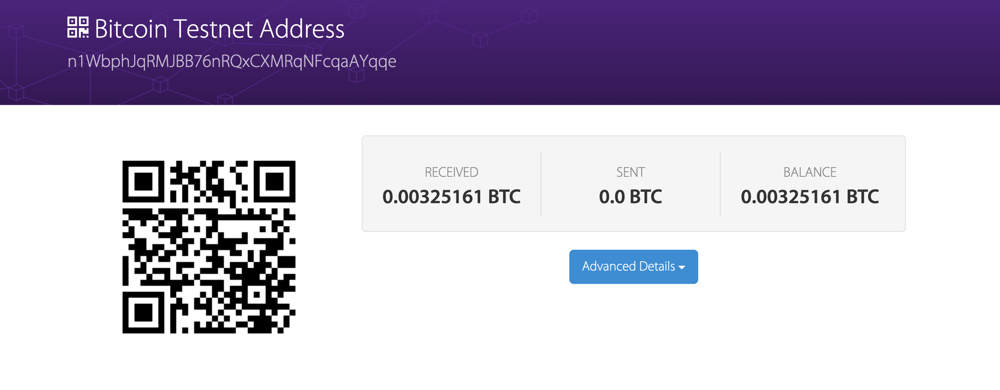

# Project Information

### Project
This folder contains the only one project for Bitcoin which is as follows:
- [Project](#Project):Send a tx on Bitcoin testate, and parse the tx data down to every bit, better write script yourself.

### Bitcoin Testnet
The testnet is an alternative Bitcoin block chain to be used for testing. Testnet coins are separate and distinct from actual bitcoins, and are never supposed to have any value. This allows application developers or bitcoin testers to experiment, without having to use real bitcoins or worrying about breaking the main bitcoin chain.You can get more information about it on https://en.bitcoin.it/wiki/Testnet.

# Project Detail
For this part, we begin with a Bitcoin address on testnet chain. The address we created form the website `bitaddress.org` is as follows:


Now our address has no balance, so next we turn to some Bitcoin Faucets to get some BTC. Then we should check out these transcations on a website which supports Bitcoin test chain query such as https://live.blockcypher.com/btc-testnet/. Enter the address we got above, and we can get all the transactions about our address.

### Summary

On the above information, we can know this address has recieved 0.00325161 BTC. We select one transaction(`948421ade8144ce1360b157097ebf62b1264461a30dc0855c471768ce00d1aba`) as an example for parsing. These are some detail about the transaction:

What we can get from this image are:
- [1 input](#):
The input address is `tb1qu6gzden0q5fqpwwz3e7pzv3wm8296q987c7w4r` and the input is 0.23238989 BTC.
- [2 outputs](#):
One output address is our testnet address `n1WbphJqRMJBB76nRQxCXMRqNFcqaAYqqe`, which we got above. This output is 0.0005 BTC. So our address got 0.0005 BTC.The other address is `tb1q3ed8dpe87j7tp5845hp43cyj35fnqzk3wmckh9` and we can find it already has been spent.
- [0.00000144 BTC Fees](#):If you notice the value transcated in the bottom of image, you can find the value transcated amount doesn’t equal the input BTC. As you think, the difference paid for miner as transaction  fee.

### More information

When we check the advanced details of the transaction, we can know that the transaction Index is 11 which means this transaction is the eleventh transaction in this block. The Block hash is `0000000000000016b964bf20869ac7983db9303dcd60562bc56200326387cb45` and its height is `2284926`.

Next we set about to prase the encoded information about the transaction whose size is 225 bytes, which can get form above image. The following are the complete field information parsed from this transaction data of every bit:


```csv
{
  "block_hash": "0000000000000016b964bf20869ac7983db9303dcd60562bc56200326387cb45",
  "block_height": 2284926,
  "block_index": 11,
  "hash": "948421ade8144ce1360b157097ebf62b1264461a30dc0855c471768ce00d1aba",
  "hex": "0200000000010189392d37c50d079102cd92d153f7f389bba0dd80f1283f6e0c865c152f5ec5690100000000feffffff026dd56101000000001600148e5a768727f4bcb0d0f5a5c358e0928d13300ad150c30000000000001976a914db516d408a520bf5066c8813a5b5a1e392af42a288ac02473044022000e339ded65e967e4a6d7283f0c8db09a1f33da241ce298020e9fc3b45e1112302201865ec939a1c0df8b27e520838b5f6a23188a78ddb5720e907e8aea2d8c7ac1a01210262af73db294ed2d3f2f9c3aabf0df8bc0670da668b43df766a30d7ea81b915117ddd2200",
  "addresses": [
    "n1WbphJqRMJBB76nRQxCXMRqNFcqaAYqqe",
    "tb1q3ed8dpe87j7tp5845hp43cyj35fnqzk3wmckh9",
    "tb1qu6gzden0q5fqpwwz3e7pzv3wm8296q987c7w4r"
  ],
  "total": 23238845,
  "fees": 144,
  "size": 225,
  "vsize": 144,
  "preference": "low",
  "relayed_by": "185.75.76.62:18333",
  "confirmed": "2022-07-09T14:34:31Z",
  "received": "2022-07-09T14:33:38.751Z",
  "ver": 2,
  "lock_time": 2284925,
  "double_spend": false,
  "vin_sz": 1,
  "vout_sz": 2,
  "confirmations": 127,
  "confidence": 1,
  "inputs": [
    {
      "prev_hash": "69c55e2f155c860c6e3f28f180dda0bb89f3f753d192cd0291070dc5372d3989",
      "output_index": 1,
      "output_value": 23238989,
      "sequence": 4294967294,
      "addresses": [
        "tb1qu6gzden0q5fqpwwz3e7pzv3wm8296q987c7w4r"
      ],
      "script_type": "pay-to-witness-pubkey-hash",
      "age": 2284925,
      "witness": [
        "3044022000e339ded65e967e4a6d7283f0c8db09a1f33da241ce298020e9fc3b45e1112302201865ec939a1c0df8b27e520838b5f6a23188a78ddb5720e907e8aea2d8c7ac1a01",
        "0262af73db294ed2d3f2f9c3aabf0df8bc0670da668b43df766a30d7ea81b91511"
      ]
    }
  ],
  "outputs": [
    {
      "value": 23188845,
      "script": "00148e5a768727f4bcb0d0f5a5c358e0928d13300ad1",
      "spent_by": "b82421d649c479b40e81c3efb1f7aae58b8c4b90d60a89cdd28723dd17c01a1c",
      "addresses": [
        "tb1q3ed8dpe87j7tp5845hp43cyj35fnqzk3wmckh9"
      ],
      "script_type": "pay-to-witness-pubkey-hash"
    },
    {
      "value": 50000,
      "script": "76a914db516d408a520bf5066c8813a5b5a1e392af42a288ac",
      "addresses": [
        "n1WbphJqRMJBB76nRQxCXMRqNFcqaAYqqe"
      ],
      "script_type": "pay-to-pubkey-hash"
    }
  ]
}
```
Notice that for input and outpus, two script_type which are `pay-to-witness-pubkey-hash` and `pay-to-pubkey-hash` are different from what we learned from the course.


# Deployment Guide

### Guid

If you want to check up above works, you can go to https://www.blockchain.com/btc-testnet/address/n1WbphJqRMJBB76nRQxCXMRqNFcqaAYqqe for the detail of this address. Note that the account balance may be empty because we probably have repaid the borrowed BTC, which you could find these transactions on the website.

### Developers

Yang Kunyang

