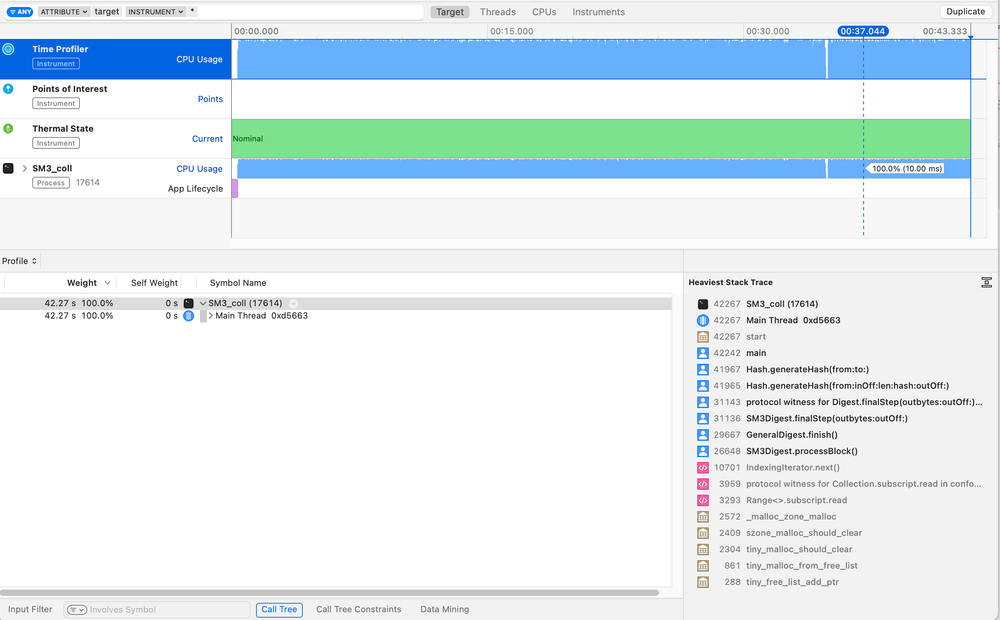

# Project Information

## Project Information
This folder contains three projects for SM3 algorithm which are as follows:
- [Project 1](#Project):Do your best to optimize SM3 implementation.
- [Project 2](#Project):Implement the naive birthday attack of reduced SM3 (64 bit, 32 bit or more shorter).
- [Project 3](#Project):Implement the Rho method of reduced of SM3.


## Folder Information
### SM3_coll
- [main.swift](#main): 
    This file contains two functions, which are the external interface called. You can switch the bool variable "problem" to change the function between birthday attack and correctness testing. You can see the follows code in it:
    ```Swift
    ...
    let reduced:Int = 7 //The whole length is 32 bytes(256 bits)
    ...
    //MARK: -Birthday Attack
    print("Naive Birthday Attack...")
    let entity1:Birthday = Birthday(reduced: reduced)
    entity1.updateAttack(rationIndex: 20.0)
    if let coll = entity1.coll{
        print("One collision was found!The coll are as follows:")
        print("One preimage:\(coll.0)")
        print("The other preimage:\(coll.1)")
        print("SM3 Hash Value:\(coll.2)")
    }else{
        print("Failed of the \(reduced) bytes reduced attack, please try it again.")
    }

    //MARK: -Rho Method
    print("Rho Method Birthday Attack...")
    let entity2:Rho = Rho(reduced: reduced)
    entity2.attack()
    if let coll = entity2.coll{
        print("One collision was found!The coll are as follows:")
        print("One preimage:\(coll.0)")
        print("The other preimage:\(coll.1)")
        print("SM3 Hash Value:\(coll.2)")
    }else{
        print("Failed of the \(reduced) reduced attack, please try it again.")
    }
    ...
    // MARK: - Test the correctness of the result
    let message1:Array<UInt8> = [63, 122, 230, 120, 83, 201, 198, 65, 134, 139, 2, 244, 247, 206, 56, 186, 227, 47, 165, 253, 117, 249, 164, 17, 157, 82, 193, 17, 132, 228, 237, 8]
    let message2:Array<UInt8> = [209, 152, 200, 17, 162, 208, 249, 201, 199, 217, 200, 131, 240, 115, 59, 14, 169, 201, 189, 171, 212, 41, 164, 47, 19, 146, 223, 97, 199, 86, 28, 179]
    let hashGenerator:Hash = Hash()
    var value1:Array<UInt8> = Array<UInt8>(repeating:0,count:32)
    var value2:Array<UInt8> = Array<UInt8>(repeating:0,count:32)

    hashGenerator.generateHash(from: message1, to: &value1)
    hashGenerator.generateHash(from: message2, to: &value2)

    print(value1)
    print(value2)
    ```
- [Birthday_Attack](#naive): 
    This folder is designed to implement the naive birthday attack for SM3 hash algorithm. The attack progress is designed in function `func attack()`. However, when we prolong the attack length this naive method will take a very long time that we couldn't accept, so we rewrite the other function which called `func updateAttack(rationIndex:Double)` to handle this case:
```Swift
...
    public func updateAttack(rationIndex:Double){
        var value:Array<UInt8> = Array<UInt8>(repeating:0,count:32)
        let ratio = Int64(pow(2.0,rationIndex))
        for counter in 1...complexity {
            var preImage = Array<UInt8>(repeating: 0, count: Int(arc4random() % 100) + 1)
            let _ = SecRandomCopyBytes(kSecRandomDefault, preImage.count, &preImage)
//            guard status == errSecSuccess else {
//                return
//            }
            hashGenerate.generateHash(from: preImage, to: &value)
            let reducedHash:Array<UInt8> = Array<UInt8>(value.prefix(reduced))
            collData[preImage] = reducedHash
            if (counter % ratio == 0) {
                let result = Dictionary(grouping: collData.keys, by: { collData[$0]! })
                let find = result.filter({ $0.value.count > 1 })
                guard let first = find.first else {
                    continue
                }
                coll = (first.value[0],first.value[1],first.key)
                return
            }
        }
    }
```
> Note that the variable `rationIndex` is the level we want to cut which means we check the preImage that have generated not by one time one preImage, but by one time ration preImage.

- [Rho_method](#Rho): 
    This folder is designed to implement the birthday attack based on Rho method for SM3 hash algorithm.The attack progress is also designed in function `func attack()`. 
```Swift
...
    public func attack(){
        var arbitrary = [UInt8](repeating: 0, count: Int(arc4random() % 100) + 1)
        let status = SecRandomCopyBytes(kSecRandomDefault,arbitrary.count, &arbitrary)
        guard status == errSecSuccess else {
            return
        }
        collData.append(arbitrary)
        for _ in 1...Int64.max {
            var value:Array<UInt8> = Array<UInt8>(repeating:0,count:32)
            hashGenerate.generateHash(from: collData.last!, to: &value)
            let reducedHash:Array<UInt8> = Array<UInt8>(value.prefix(reduced))
            let find = collData.filter({ Array<UInt8>($0.prefix(reduced)) == reducedHash})
            if !find.isEmpty {
                let index = collData.firstIndex(of: find.first!)!
                guard index != 0 else{
                    return
                }
                coll = (collData[index-1],collData.last!,reducedHash)
                return
            }else{
                collData.append(value)
            }
        }
    }
```
- [Cryptography](#SM3): 
    This folder contains the basic algorithms for the implementation of SM3 hash algorithm on which the above two attack methods are based. And in this project, we attempt to optimize SM3 implementation. Then main implementation part for SM3 is in file `SM3Digest.swift` which almost cotains the half bytes processing in SM3 algorithm. And the optimizing method we use are mostly Byte operation instead of Integration method which can make the calculation time reduce, as well other method which reduces repeated references and inheritance.

### SM3_coll.xcodeproj
This folder contains the main file for Xcode Project. With this xcodeproj, we can directly integrate the all functions and projects in one project. 

# Run Screenshots
For this part, we specify the reduced as 3 for convenience and then we can get the running result immediately and find the collision:


For the implementation of SM3, our default implementation of its attack has proved the correctness of the algorithm. So we don't give the screenshot of this part and more information will be gave in the `Project Results` part.


# Project Results
Through two attack methods, the longest collision we find are as follows : message1 and message 2 are our preimage and their SM3 hash value collide at the 6 bytes prefix : [183, 110, 20, 205, 186, 77], 51 bits accurately. 

## One collision(51 bits)
- [message1](#message)
    [239, 134, 147, 193, 120, 145, 25, 241, 254, 93, 111, 120, 123, 71, 78, 138, 100, 232, 207, 252, 165, 120, 16, 95, 98, 45, 156, 6, 139, 142, 42, 251]
- [message2](#message)
    [27, 65, 78, 110, 42, 230, 36, 191, 130, 99, 45, 0, 13, 250, 189, 146, 35, 76, 208, 138,  51, 216, 70, 75, 204, 137, 192, 72, 19, 62, 235, 195]
- [reduced(prefix 51) hash value](#coll)
    10110111 1101110 00010100 11001101 10111010 01001101 101

##Another collision(50 bits)
- [message1](#message)
    [63, 122, 230, 120, 83, 201, 198, 65, 134, 139, 2, 244, 247, 206, 56, 186, 227, 47, 165, 253, 117, 249, 164, 17, 157, 82, 193, 17, 132, 228, 237, 8]
- [message2](#message)
    [209, 152, 200, 17, 162, 208, 249, 201, 199, 217, 200, 131, 240, 115, 59, 14, 169, 201, 189, 171, 212, 41, 164, 47, 19, 146, 223, 97, 199, 86, 28, 179]
- [reduced(prefix 50) hash value](#coll)
    1001111 00011100 00110000 00000010 00110001 10100010 00

> Notice: Message 1 and message 2 have the same length: 256 bits, which both are coded in an UInt8 array.

## SM3
For the implementation of SM3, we attempt a lot of messages of irregular length to evaluate the proformance of algorithm we accomplished. And the result are as follows:

- [1,000 times](#result1)
> 
When we use SM3 Hash for 1,000 messages of irregular length, it costs approximate 480ms which means 0.48ms for one time hash in average. 

- [10,000 times](#result2)
> 
When we use SM3 Hash for 10,000 messages of irregular length, it costs approximate 4.31s which means 0.431ms for one time hash in average. 

- [100,000 times](#result3)
> 
The 100,000 times test means that 0.4227ms for one time hash in average.


# Deployment Guide

## Guid

For this part, we use Swift to implement the above three projects, which as you see are all contained in one Xcode project named `SM3_coll`. If you want to
test this project in your own computer, you can download this folder and then drag SM3_coll.xcodeproj in your Xcode. If necessary, you should click "Trust and Open" for the next steps.

## Developers

Yang Kunyang

